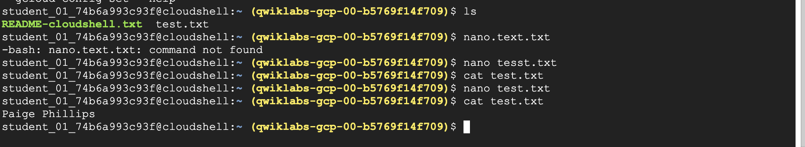

# Lab1 - Complete QwikLabs tour of Google Cloud Platform

You should access the QwikLabs tour and Google Cloud Platform (GCP)
overview at [https://www.qwiklabs.com/focuses/2794?parent=catalog](https://www.qwiklabs.com/focuses/2794?parent=catalog).

This lab should be very easy -- you're basically following an online
tutorial to learn how to use a software platform. 

After finishing that exercise, complete this one: 
[https://www.cloudskillsboost.google/focuses/563?parent=catalog](https://www.cloudskillsboost.google/focuses/563?parent=catalog).
This will require a QwikLabs credit. Info on how to utilize credits will be
provided in class. You can individually request 200 from [https://services.google.com/fb/forms/googlecloudskillsbooststudenttrainingcreditsapplication/](https://services.google.com/fb/forms/googlecloudskillsbooststudenttrainingcreditsapplication/)

Some additional
challenges will be that you're going to be accepting this lab through
Github Classroom and submitting your solution using git.

At the end of the second lab, edit a file called test.txt.  Write your name into that file.  
Then, in the gcloud shell run "cat test.txt" and take a screen shot.

You should name your image something like
"lab1-finish-YOURNAME.png". You should then modify this README.md to
display your image rather than the image I provided. This will
evaluate your ability to:

* Complete the Qwiklab on using Google cloud
* Accepting a Github Classroom assignment
* Checkout out a Git repo
* Adding a file to the staging (`git add your-file-name.png`)
* Updating a Markdown file
* Commiting your changes (`git commit -a -m'your message here'`)
* Pushing the changes to Github (`git push`)

